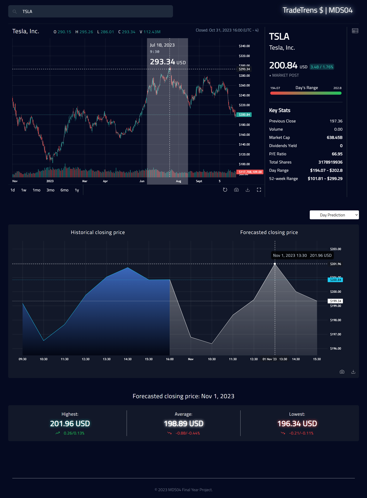

# Stock Market Forecasting Application

## Motivation
Our project is motivated by the application of cutting-edge meta-learning models to enhance stock market forecasting. Meta-learning, which involves "learning to learn," empowers these models to adapt to new, unseen tasks by drawing on their extensive training across various domains. This adaptability is particularly valuable in the unpredictable and dynamic world of stock markets. Our project aims to provide investors and analysts with more robust, adaptable, and accurate tools for making informed investment decisions.

Meta-Learning Model Implemented:
N-BEATS (Neural Basis Expansion Analysis for Time Series Forecasting) Model + RevIN (Reversible Instance Normalization and Denormalization) Layers

## Technologies & Libraries & Platforms Used:
### Technologies:
- Python (Model)
- Next.js
- TypeScript
- Tailwind CSS
- Express.js (Back-end Server)
- Flask (Back-end Server)

### Libraries:
- TensorFlow
- numpy
- pandas
- matplotlib
- yfinance

### Platforms:
- VS Code
- Google Colab

## Dashboard Preview
### Landing Page

### Main Page

## Steps to run the code
#### Software:
1. Clone this GitHub repository or download it as a zip file.
2. Refer to Section 2 - Technical Guides in the User Guides document.

#### Model Training Colab Files:
1. Open the colab notebook files in the nbeats_revin_model_training_colab folder through Google Colab.
